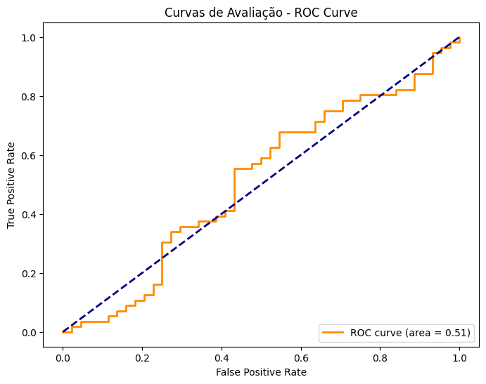
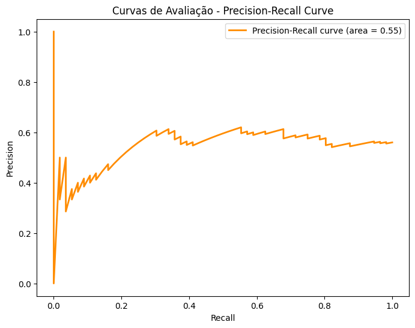
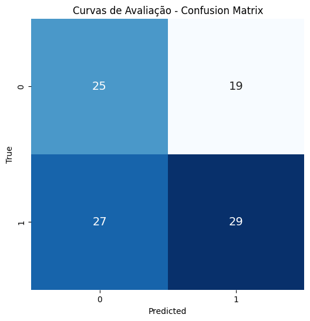

<span style="font-family: 'Ariel', sans-serif; font-size: 24px;">Descrição</span>


<span style="font-family: 'Ariel', sans-serif; font-size: 16px;">A Biblioteca Predatamaker foi desenvolvida como uma ferramenta versátil para manipulação e geração de dados simulados, proporcionando funcionalidades abrangentes para experimentação em aprendizado de máquina e análise de dados. Com essa biblioteca, é possível organizar conjuntos de dados, gerar curvas de avaliação, extrair características relevantes e criar tabelas simuladas para experimentação.</span>

<span style="font-family: 'Ariel', sans-serif; font-size: 24px;">Funcionalidades</span>


<span style="font-family: 'Ariel', sans-serif; font-size: 16px;">• Organiza dados em diferentes estruturas como listas e arquivos csv.

• Gera e exibe curvas de avaliação, incluindo ROC curve, Precision-Recall curve e Confusion Matrix.

• Extrai características relevantes de um conjunto de dados, utilizando métodos como seleção, PCA ou remoção de características correlacionadas.

• Gera tabelas simuladas para experimentação, com opções de modelos lineares, quadráticos ou aleatórios.</span>

<span style="font-family: 'Ariel', sans-serif; font-size: 24px;">Como Usar</span>

<span style="font-family: 'Ariel', sans-serif; font-size: 16px;">1. Instalar pacote</span>

```python
pip install Predatamaker
```

<span style="font-family: 'Ariel', sans-serif; font-size: 16px;">2. Importar Biblioteca</span>


```python
from Predatamaker import Predatamaker
```

<span style="font-family: 'Ariel', sans-serif; font-size: 16px;">3. Criação da instância da classe:</span>


```python
predatamaker = Predatamaker()
```

<span style="font-family: 'Ariel', sans-serif; font-size: 24px;">Usando metodos</span>

<span style="font-family: 'Ariel', sans-serif; font-size: 16px;"># Exemplo de organização de dados csv</span>


```python
caminho_arquivo_csv = "C:/Users/mateu/Downloads/dados.csv"
novo_arquivo_csv = "C:/Users/mateu/Downloads/teste_ordenado.csv"

dados_organizados = predatamaker.organizar_dados(caminho_arquivo_csv, tipo_estrutura='csv', chave_ordenacao='IDADE',novo_arquivo=novo_arquivo_csv)
```

<span style="font-family: 'Ariel', sans-serif; font-size: 16px;"># Exemplo de organização de dados com listas</span>


```python
dados_lista = [
    {'ID': 3, 'Nome': 'Alice', 'Idade': 25},
    {'ID': 1, 'Nome': 'Bob', 'Idade': 30},
    {'ID': 2, 'Nome': 'Charlie', 'Idade': 22}
]

# Chamar a função para organizar os dados por ID
dados_organizados_lista = predatamaker.organizar_dados(dados_lista, tipo_estrutura='lista', chave_ordenacao='ID')

# Imprimir os dados organizados
print("Dados organizados (Lista):", dados_organizados_lista)
```

    Dados organizados (Lista): [{'ID': 1, 'Nome': 'Bob', 'Idade': 30}, {'ID': 2, 'Nome': 'Charlie', 'Idade': 22}, {'ID': 3, 'Nome': 'Alice', 'Idade': 25}]
    

<span style="font-family: 'Ariel', sans-serif; font-size: 16px;"># Exemplo de curvas de avaliação.</span>


```python
import numpy as np

np.random.seed(42)
y_true_example = np.random.randint(2, size=100)
y_probabilidades_example = np.random.rand(100)

# Chamando a função com os dados de exemplo
Predatamaker.gerar_curvas_avaliacao(y_true_example, y_probabilidades_example)
```


    

    


    

    


    

    


<span style="font-family: 'Ariel', sans-serif; font-size: 16px;"># Exemplo para extrair caracteristicas relevantes</span>


```python
import pandas as pd
X = pd.DataFrame({'A': [1, 2, 3], 'B': [4, 5, 6], 'C': [7, 8, 9]})
y = np.array([0, 1, 0])

X_relevante = Predatamaker.extrair_caracteristicas_relevantes(X, y, metodo='selecao', k=2)
print("Características relevantes (seleção):", X_relevante)
```

    Características relevantes (seleção):    B  C
    0  4  7
    1  5  8
    2  6  9
    

<span style="font-family: 'Ariel', sans-serif; font-size: 16px;"># Exemplo para Gerar tabelas simuladas para experimentação.</span>


```python
tabelas_simuladas = Predatamaker.gerar_tabelas(num_tabelas=2, num_colunas=3, num_amostras=5, modelo='linear', coeficientes=[2, 1, 0.5])
for i, tabela_simulada in enumerate(tabelas_simuladas):
    print(f"Tabela Simulada {i+1}:\n", tabela_simulada)
```

    Tabela Simulada 1:
              X1        X2        X3         Y
    0  0.908266  0.239562  0.144895  2.079198
    1  0.489453  0.985650  0.242055  2.177900
    2  0.672136  0.761620  0.237638  2.395370
    3  0.728216  0.367783  0.632306  2.227728
    4  0.633530  0.535775  0.090290  1.848893
    Tabela Simulada 2:
              X1        X2        X3         Y
    0  0.226496  0.645173  0.174366  1.148794
    1  0.690938  0.386735  0.936730  2.076227
    2  0.137521  0.341066  0.113474  0.691308
    3  0.924694  0.877339  0.257942  2.881686
    4  0.659984  0.817222  0.555201  2.492973
    

<span style="font-family: 'Ariel', sans-serif; font-size: 24px;">Notas</span>

<span style="font-family: 'Ariel', sans-serif; font-size: 16px;">• Certifique-se de ter as bibliotecas necessárias instaladas, como pandas, numpy, scikit-learn, matplotlib, seaborn.

• Alguns métodos possuem parâmetros opcionais que podem ser ajustados conforme necessário.

• Consulte a documentação da biblioteca para obter mais detalhes sobre cada método.</span>
